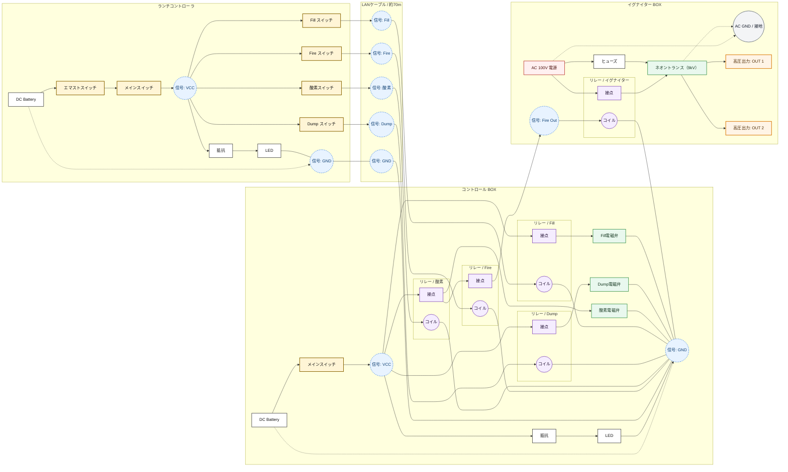

```mermaid
graph LR
    classDef component fill:#ffffff,stroke:#333333,stroke-width:1.5px,color:#111111;
    classDef switch fill:#fff5d6,stroke:#8a6500,stroke-width:2px,color:#111111;
    classDef signal fill:#e8f3ff,stroke:#1f6feb,stroke-width:1.5px,stroke-dasharray:4 3,color:#0b3d70;
    classDef lanSignal fill:#e8f3ff,stroke:#1f6feb,stroke-width:1.5px,stroke-dasharray:4 3,color:#0b3d70,min-width:78px,height:42px;
    classDef relay fill:#f5edff,stroke:#7b3fb3,stroke-width:1.5px,color:#221133;
    classDef actuator fill:#e9f8ee,stroke:#238636,stroke-width:1.5px,color:#12351d;
    classDef ac fill:#fff0f0,stroke:#b42318,stroke-width:1.5px,color:#4a0f0a;
    classDef hv fill:#fff4e6,stroke:#d97706,stroke-width:2px,color:#4a2800;
    classDef ground fill:#f3f4f6,stroke:#4b5563,stroke-width:1.5px,color:#111827;

    %% 点火点 (Ignition Point)
    subgraph Ignition_Point [ランチコントローラ]
        B1[DC Battery]:::component --> SW_EStop1[エマストスイッチ]:::switch
        SW_EStop1 --> SW_Main1[メインスイッチ]:::switch
        SW_Main1 --> VCC1((信号: VCC)):::signal
        B1 -.-> GND_Point((信号: GND)):::signal

        VCC1 --> R_LED1[抵抗]:::component
        R_LED1 --> LED1[LED]:::component
        LED1 --- GND_Point

        VCC1 --> SW_Fire[Fire スイッチ]:::switch
        VCC1 --> SW_Oxygen[酸素スイッチ]:::switch
        VCC1 --> SW_Dump[Dump スイッチ]:::switch
        VCC1 --> SW_Fill[Fill スイッチ]:::switch
    end

    %% 信号線 (LANケーブル)
    subgraph LAN_Cable [LANケーブル / 約70m]
        direction TB
        L_Fire((信号: Fire)):::lanSignal
        L_Oxygen((信号: 酸素)):::lanSignal
        L_Dump((信号: Dump)):::lanSignal
        L_Fill((信号: Fill)):::lanSignal
        L_GND((信号: GND)):::lanSignal
    end

    SW_Fire --> L_Fire
    SW_Oxygen --> L_Oxygen
    SW_Dump --> L_Dump
    SW_Fill --> L_Fill
    GND_Point --- L_GND

    %% GSE (コントロール BOX)
    subgraph GSE [コントロール BOX]
        B2[DC Battery]:::component --> SW_Main2[メインスイッチ]:::switch
        SW_Main2 --> VCC2((信号: VCC)):::signal
        B2 -.-> GND_GSE((信号: GND)):::signal

        VCC2 --> R_LED2[抵抗]:::component
        R_LED2 --> LED2[LED]:::component
        LED2 --- GND_GSE
        L_GND --- GND_GSE

        %% Relays: physical count = 4
        subgraph RLY_Fire [リレー / Fire]
            RLY_Fire_Coil((コイル)):::relay
            RLY_Fire_Contact[接点]:::relay
        end
        subgraph RLY_Oxygen [リレー / 酸素]
            RLY_Oxygen_Coil((コイル)):::relay
            RLY_Oxygen_Contact[接点]:::relay
        end
        subgraph RLY_Dump [リレー / Dump]
            RLY_Dump_Coil((コイル)):::relay
            RLY_Dump_Contact[接点]:::relay
        end
        subgraph RLY_Fill [リレー / Fill]
            RLY_Fill_Coil((コイル)):::relay
            RLY_Fill_Contact[接点]:::relay
        end

        L_Fire --> RLY_Fire_Coil
        L_Oxygen --> RLY_Oxygen_Coil
        L_Dump --> RLY_Dump_Coil
        L_Fill --> RLY_Fill_Coil

        RLY_Fire_Coil --- GND_GSE
        RLY_Oxygen_Coil --- GND_GSE
        RLY_Dump_Coil --- GND_GSE
        RLY_Fill_Coil --- GND_GSE

        VCC2 --> RLY_Oxygen_Contact
        VCC2 --> RLY_Dump_Contact
        VCC2 --> RLY_Fill_Contact
        RLY_Oxygen_Contact --> RLY_Fire_Contact

        %% 電磁弁
        RLY_Oxygen_Contact --> Valve_Oxygen[酸素電磁弁]:::actuator
        RLY_Dump_Contact --> Valve_Dump[Dump電磁弁]:::actuator
        RLY_Fill_Contact --> Valve_Fill[Fill電磁弁]:::actuator

        Valve_Oxygen --- GND_GSE
        Valve_Dump --- GND_GSE
        Valve_Fill --- GND_GSE
    end

    %% GSE（イグナイター BOX）
    RLY_Fire_Contact --> L_Fire_Out((信号: Fire Out)):::signal

    subgraph Igniter_Box [イグナイター BOX]
        %% Relay: physical count = 1
        subgraph IGN_RLY [リレー / イグナイター]
            Ign_Relay_Coil((コイル)):::relay
            Ign_Relay_Contact[接点]:::relay
        end

        L_Fire_Out --> Ign_Relay_Coil
        Ign_Relay_Coil --- GND_GSE

        AC_Power[AC 100V 電源]:::ac --> Ign_Relay_Contact
        AC_Power -.-> AC_GND((AC GND / 接地)):::ground

        Ign_Relay_Contact --> Neon[ネオントランス（9kV）]:::actuator
        AC_Power --> Fuse3[ヒューズ]:::component
        Fuse3 --> Neon
        Neon -.-> AC_GND

        Neon --> OUT1[高圧出力: OUT 1]:::hv
        Neon --> OUT2[高圧出力: OUT 2]:::hv
    end
```
